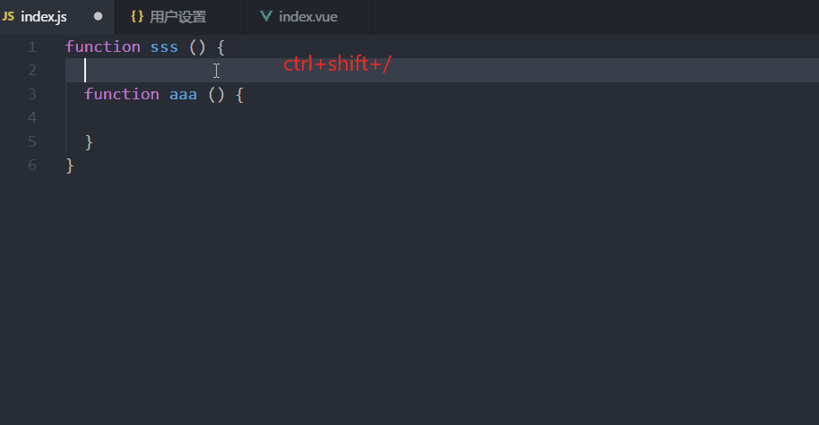
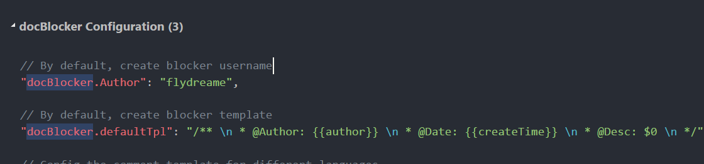

# DocBlocker

Adds simple comments to any place.

## Using

## Configuration

In the User Settings inside, set and modify the creator's name or the comments template

## Change Log

0.1.0

+ Support the configuration and update the creator's name or the comments template